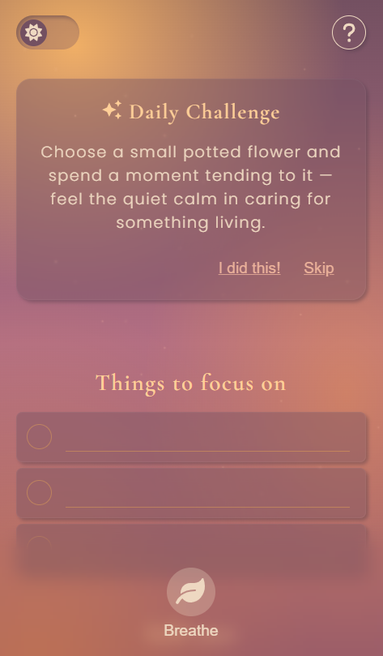
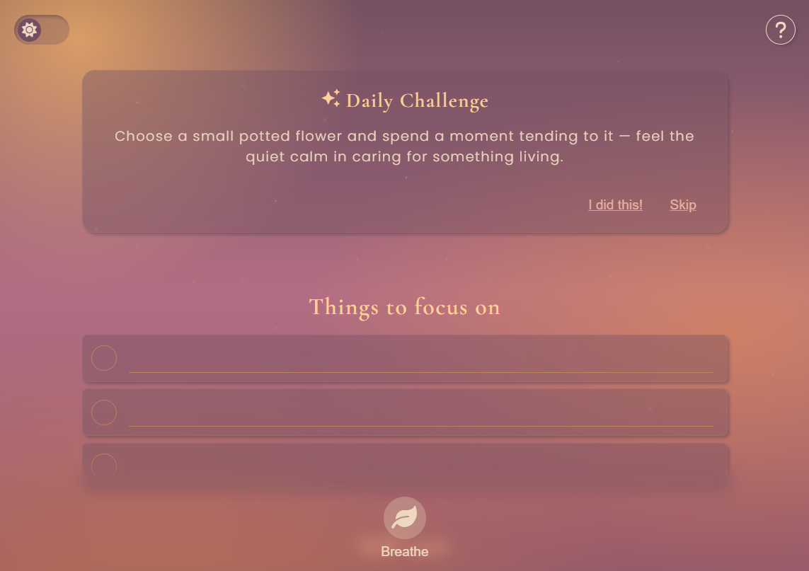
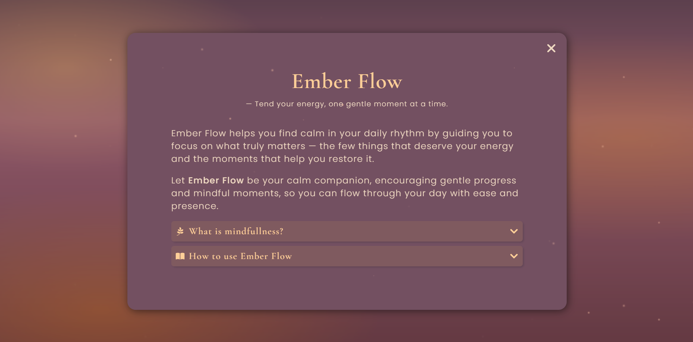
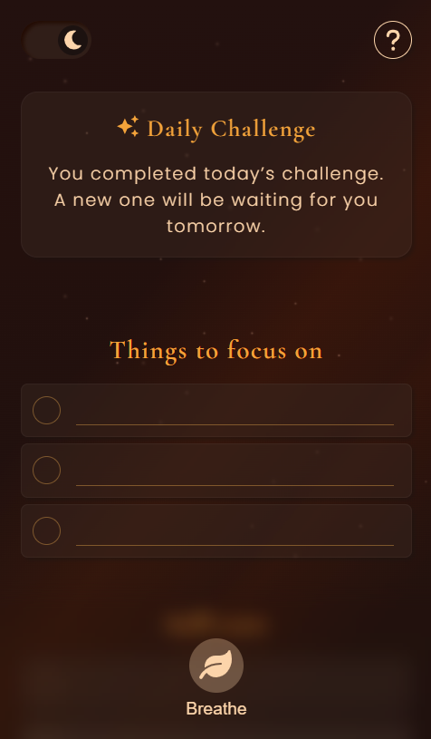
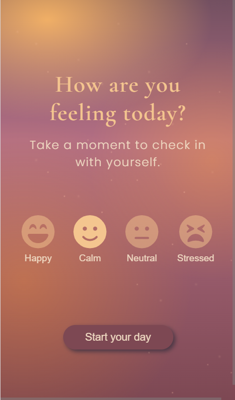
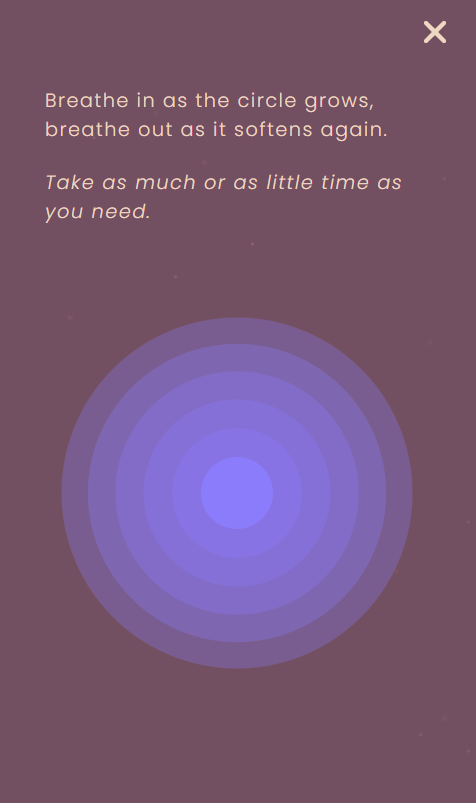
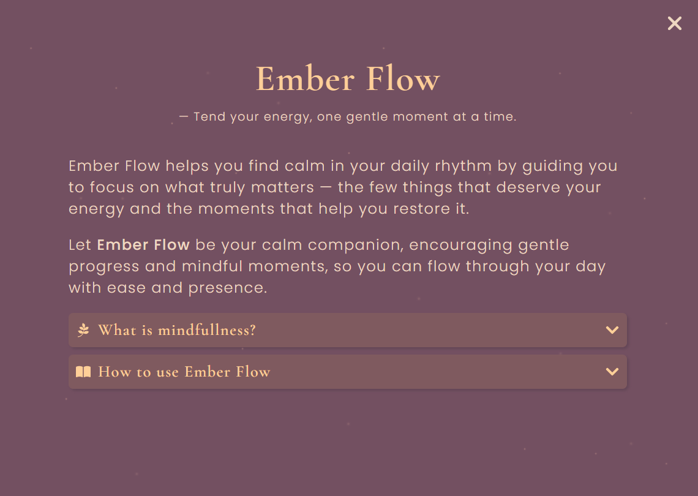

# Ember Flow

A mood-based web application that combines task management with mindful habits.

## Description

Ember Flow helps you manage fewer but essential tasks while helping you feel calm and relaxed while doing them. Each day is a fresh start; incomplete tasks will not be saved for the next day, so users can focus on what matters today without the stress of incomplete tasks. The goal is to help users feel productive without stress and remind them of the importance of taking care of themselves too, by balancing a few daily tasks with self-care and relaxation.

## Tech Stack

- React + Vite + TypeScript
- Axios for API-calls
- SCSS for styling
- react-icons for graphics
- MongoDB and Mongoose for backend
- Jest for unit tests

## Project structure

```text
Ember Flow
|── Backend
| |── src
| | |── controllers
| | |── models
| | |── routes
| |── package.json
|── Frontend
| |── src
| | |── `__tests__`
| | |── components
| | |── contexts
| | |── hooks
| | |── models
| | |── pages
| | |── reducers
| | |── services
| | |── styles
| | |── utils
| | |── App.tsx
| | |── Router.tsx
| |── package.json
| |── index.html
|── README.md
```

## Features

- mood check-in
- task management
- a positive affirmation “reward” after completed tasks
- a random daily challenge based on the user’s mood (optional, this is not a task)
- a “pause/breath” – button with animation that you can click whenever you feel stressed
- and a cozy, visually appealing UI design with a theme toggle switch

## User Flow

1. First-time welcome modal
2. Mood check-in modal (once a day)
3. Dashboard with tasks, challenge, breathe button, help button, and theme toggle.
4. Task creation, editing and completion.
5. Positive affirmation modal on task and challenge completion.

## Technical Highlights

- Conditional rendering based on time and user state (daily resets, first-time welcome)
- Time-based logic for daily dashboard resets
- Dynamic content generation based on user mood
- Context for tasks, mood, theme, and challenges
- Modal management
- CSS-based breathing animation and background twinkling star animations.

## Accessibility

This application follows basic web accessibility best practices, including:

- Semantic HTML
- Keyboard navigation
- Form labels and inputs hidden with sr-only class instead of display: none/visibility: hidden so they remain availbale to screen readers
- Text still readable at 200%
- Sufficient color contrast
- Text together with interactive icons

## Getting Started

### Prerequisites

Make sure the following are installed on your system:

- Node.js v18.16+ (includes npm)
- MongoDB v6+ (local or cloud instance)

### Installation

```bash
# 1. Clone the repo:
git clone https://github.com/maa-lin/Ember-Flow.git
cd ember-flow

# 2. Backend setup
cd backend
npm install

# Create .env file in backend folder with PORT= and MONGO_URL

# Start the backend server
npm run dev

# 3. Frontend setup
cd ../frontend
npm install
npm run dev


```

## Screenshots








